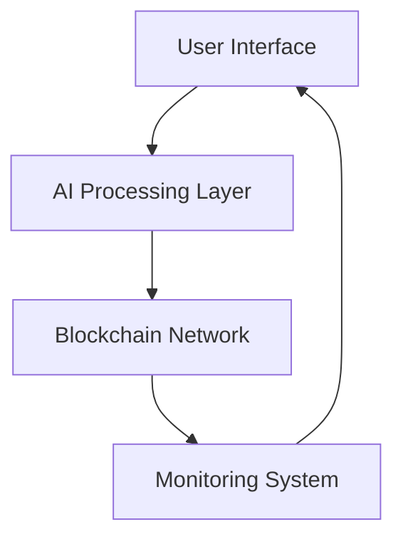

# Content Guardian: Blockchain-Powered Creative Rights Protection System  
[](https://opensource.org/licenses/MIT) 
 
 


A decentralized ecosystem combining AI-powered content verification with blockchain security for digital rights management and automated royalty distribution.

## 🌟 Introduction
Content Guardian revolutionizes creative rights protection through:

- **AI-Powered DNA Mapping** - Unique content fingerprinting
- **Immutable Ownership Proof** - Blockchain-based verification
- **Smart Licensing** - Self-executing royalty contracts
- **Real-Time Monitoring** - Cross-platform infringement detection

## 🛠️ Core Components

### 🧠 Neural Processing Core

```python
class ContentAnalyzer:
    def generate_digital_dna(self, asset):
        # Deep learning pattern recognition
        return ai_model.process(asset)
```
### ⛓️ Distributed Ledger Framework

```solidity
contract ContentRegistry {
    struct Asset {
        string dnaHash;
        address owner;
        uint256 timestamp;
    }
    
    mapping(bytes32 => Asset) public assetRegistry;
}
```

### 🛡️ Integrity Shield

```javascript
class ProtectionMonitor {
  async detectInfringement(contentHash) {
    const matches = await blockchainScanner.scanWeb(contentHash);
    return this.analyzeMatches(matches);
  }
}
```
### 🚀 Quick Start

Prerequisites

1. Node.js v16+
2. Python 3.9+

3. Ethereum Client (Ganache)

4. TensorFlow 2.8+

### Installation

```bash
git clone https://github.com/yourusername/content-guardian.git
cd content-guardian
npm install
pip install -r requirements.txt
truffle migrate --reset
npm run dev
```
### 📚 Usage Guide

#### 1. **Register Content**

```javascript
const guardian = new ContentGuardian();
const contentHash = await guardian.registerAsset({
  file: "artwork.png",
  metadata: {creator: "0x...", category: "digital_art"}
});
```

#### 2. **Manage Licenses**

```solidity
// Create smart license
LicenseManager.createLicense(
  contentHash,
  LicenseType.COMMERCIAL,
  { fee: 0.05 ether, validUntil: 1735689600 }
);
```

#### 3. **Monitor Usage**

```python
monitor = IntegrityShield()
report = monitor.generate_report(
  content_hash="QmXyZ...",
  platforms=["social", "marketplaces"]
)
print(report.infringements)
```

### 🏗️ System Architecture



### 🌍 Market Applications

| Sector         | Features Enabled                           |
|:---------------|:-------------------------------------------|
| Digital Art    | NFT Authentication, Derivative Tracking    |
| Music          | Sample Clearance, Royalty Distribution     |
| Publishing     | Plagiarism Detection, Rights Management    |

### 📈 Roadmap

1. Multi-chain compatibility

2. Mobile SDK release

3. DAO governance prototype

4. AI Valuation Engine

5. Decentralized Arbitration

6. Marketplace Integration

### 🤝 Contributing

1. Fork the repository

2. Create feature branch (git checkout -b feature/AmazingFeature)

3. Commit changes (git commit -m 'Add AmazingFeature')

4. Push to branch (git push origin feature/AmazingFeature)

5. Open Pull Request

See CONTRIBUTING.md for detailed guidelines.

### 📜 License

Distributed under MIT License. See LICENSE for more information.

### 📧 Contact

Project Lead: John Doe - john@contentguardian.io

Technical Support: support@contentguardian.io

GitHub Issues: https://github.com/yourusername/content-guardian/issues
